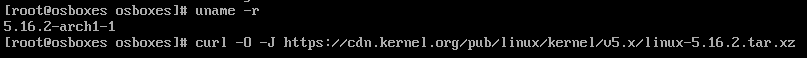
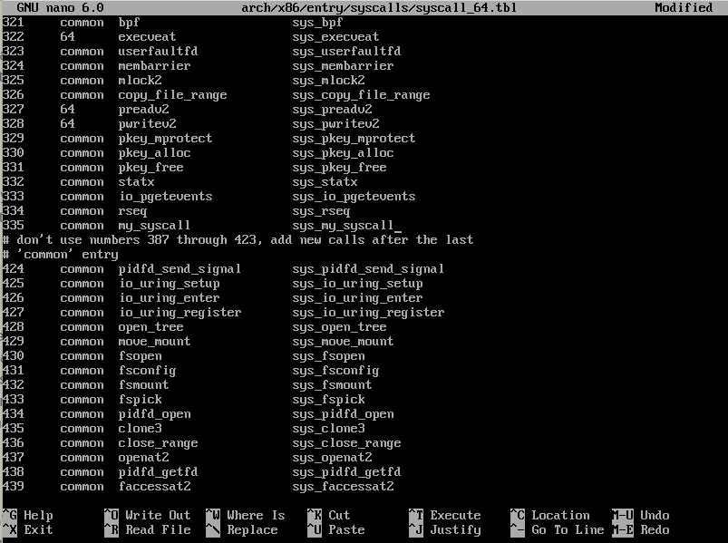

# How I wrote a system call for Linux

> *Note* :
>
> I did it on ARCH Linux with Linux kernel 5.14.6-arch1-1.

## Setup

**! First of all we need to setup a VM !**

I used VirtualBox for this purpose. You can use any other VM software.

1. Download the Linux distribution of your choice. I used the one from osboxes : [Linux Distributions](https://www.osboxes.org/arch-linux/#archlinux-202109-vbox)

If want to use this one too, just unzip the downloaded file and you will get a .vdi file.

2. Create a new VM in VirtualBox and attach the downloaded ISO file to it.


3. Start the VM and login with the username and password provided in the download page.

> *Note* :
>
> Mine was `osboxes` as username and `osboxes.org` as password.
>
> ! The keyboard layout is US ! If you want to change it, you can do it using : `loadkeys fr` for example in root mode.

4. The first preparation step you should take is to install bc, a build-time dependency of Linux that isn’t included in the virtual machine.

```bash
$ sudo pacman -S archlinux-keyring
$ sudo pacman -Syu
$ sudo pacman -S bc
$ reboot
```

## Download the Linux source code

1. Download the Linux source code from the official website : [Linux Kernel](https://cdn.kernel.org/pub/linux/kernel/v5.x/)

Choose the version who is the closest to the one you are using. You can check your version with `uname -r`. Mine was 5.16.2.

 

then use curl -O -J to download the source code :

```bash
$ curl -O -J https://cdn.kernel.org/pub/linux/kernel/v5.x/linux-5.16.2.tar.xz
```

2. Extract the source code :

```bash
$ tar xvf linux-VERSION.tar.xz
$ cd linux-VERSION
```

If you encounter any problem with the extraction, you can use the following command :

```bash
$ file linux-VERSION.tar.xz
```

If the output isn't a compressed file, you can use the following command :
you might need to install an other file format or download the file from an other source.

## Write the system call :

1. Configure the kernel :

```bash
$ cd linux-VERSION
```

The Linux Kernel is extraordinarily configurable; you can enable and disable many of its features, as well as set build parameters. If you were to make every configuration choice manually, you’d be doing it all day. Instead, you can skip this step by simply copying your kernel’s existing configuration, which is conveniently stored (in most Linux computers) in the compressed file /proc/config.gz. To use this configuration for your new kernel, use the command:

```bash
$ zcat /proc/config.gz > .config
```

To ensure that you have values for all configuration variables, run make oldconfig. More than likely, this will not ask you any configuration questions.

```bash
$ make oldconfig
```

The only configuration item that you ought to modify is the kernel name, to ensure that it doesn’t conflict with your currently installed one. On Arch Linux, the kernel is built with the suffix `-ARCH`. You should change this suffix to something unique to you: I used `-MyARCH`. To do this, the simplest way is to open .config with a text editor, and modify this line directly. You’ll find it just under the “General setup” heading, not too far down the file:

```bash
CONFIG_LOCALVERSION="-MyARCH"
```

> *Note* :
>
> If you use nano you can find the line with `CTRL + W` and then type `CONFIG_LOCALVERSION` and press `Enter`.

2. Add the system call in the system call table :

The file containing the system call table for x86_64 is located in `arch/x86/entry/syscalls/syscall_64.tbl`. This table is read by scripts and used to generate some of the boilerplate code, which makes our lives a lot easier! Go to the bottom of the first group of system calls (the ones that are not marked as “compat” or “32bit”), and add a new line for your system call. The format is:

```bash
NUMBER    x    my_syscall    sys_my_syscall
```

Where NUMBER is the next available system call number, and my_syscall is the name of your system call. The x is a placeholder for the architecture, and __x64_sys_my_syscall is the name of the system call as it will be known in the kernel source code.

> *Note* :
>
> Each value is separated by tabulations NO SPACES !.

Mine look like that :

(It's the syscall number 335)


3. Code the system call :

The last step is to write the function for the system call! We haven’t really gone into what the system call should do, but really all we would like is to do something simple that we can observe. An easy thing to do is write to the kernel log using printk(). So, our system call will take one argument, a string, and it will write it to the kernel log.

You can implement system calls anywhere, but miscellaneous syscalls tend to go in the kernel/sys.c file. Put this somewhere in the file:

```c
SYSCALL_DEFINE1(my_syscall, char *, msg)
{
  char buf[256];
  long copied = strncpy_from_user(buf, msg, sizeof(buf));
  if (copied < 0 || copied == sizeof(buf))
    return -EFAULT;
  printk(KERN_INFO "my_syscall called with \"%s\"\n", buf);
  return 0;
}
```

SYSCALL_DEFINE\<N\> is a family of macros that make it easy to define a system call with N arguments. The first argument to the macro is the name of the system call (without sys_ prepended to it). The remaining arguments are pairs of type and name for the parameters. Since our system call has one argument, we use SYSCALL_DEFINE1, and our only parameter is a char * which we name msg.

An interesting issue that we encounter immediately is that we cannot directly use the msg pointer provided to us. There are several reasons why this is the case, but none are very obvious!

- The process could try to trick us into printing out data from kernel memory by giving us a pointer that maps to kernel space. This should not be allowed.
- The process could try to read another process’s memory by giving a pointer that maps into another process’s address space.
- We also need to respect the read/write/execute permissions of memory.

To handle these issues, we use a handy `strncpy_from_user()` function which behaves like normal strncpy, but checks the user-space memory address first. If the string was too long or if there was a problem copying, we return EFAULT (although returning EINVAL for a too-long string might be better).

Finally, we use printk with the KERN_INFO log level. This is actually a macro that resolves to a string literal. The compiler concatenates that with the format string and printk() uses it to determine the log level. Finally, printk does formatting similar to printf(), which is where the %s comes i n.

4. Build and deploy the kernel :

This part is a bit more complicated so I write a script to do it for you. 


deploy.sh
```bash
#!/usr/bin/bash
# Compile and "deploy" a new custom kernel from source on Arch Linux

# Change this if you'd like. It has no relation
# to the suffix set in the kernel config.
SUFFIX="-MyARCH"

# This causes the script to exit if an error occurs
set -e

# Compile the kernel
make
# Compile and install modules
make modules_install

# Install kernel image
cp arch/x86_64/boot/bzImage /boot/vmlinuz-linux$SUFFIX

# Create preset and build initramfs
sed s/linux/linux$SUFFIX/g \
    </etc/mkinitcpio.d/linux.preset \
    >/etc/mkinitcpio.d/linux$SUFFIX.preset
mkinitcpio -p linux$SUFFIX

# Update bootloader entries with new kernels.
grub-mkconfig -o /boot/grub/grub.cfg
```

You can use it with the following command :

```bash
$ chmod u+x deploy.sh
$ sudo ./deploy.sh
```

Once the script is complete run `reboot`
